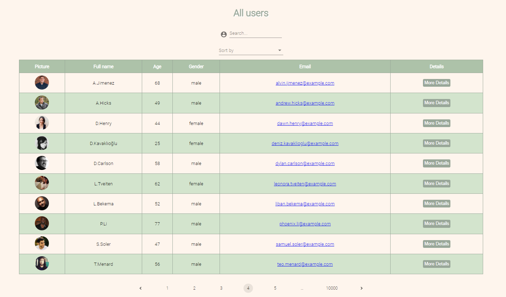

# Users List 👥

Users list Moveo homework - fetch users details from external API,
Display the data as a paginated list or user profile page.

---

## My app -

## Global use - 🌎

### ✨ [Visit my website!](https://ofirsalem1.github.io/users-moveo/#/) ✨

## Local use - 📌

- **Clone this repo**
- **Run `npm install` to install all the dependencies**
- **Run `npm start` to start the application**

### Features - 💫

- **In the main page you will see a table of users which will contain the following details**

  - **Picture** 🖼️
  - **Full name (first letter of first name and last name)**
  - **Email - by click send the user new email** 📩
  - **Gender** 👩‍🦰🧑
  - **Age** 👴👶
  - **Button to more details**
  - **Search input** - **you can search by the following parameters : name, email, age** 🔍

- **In the more details page you will see the following details:**
  - **The user address on a map with a pin** 🗺️
  - **Card with the user details** 🃏

---

### Technologies in use - 👩‍💻👨‍💻

- **[React](https://reactjs.org/)**
- **[TypeScript](https://www.typescriptlang.org/)**
- **[React Router DOM](https://www.npmjs.com/package/react-router-dom)**

#### Packages - 📦

- **[Axios](https://www.npmjs.com/package/axios) - For API requests**
- **[Openlayers](https://openlayers.org/) - for maps**
- **[MUI](https://mui.com/getting-started/usage/) - for styling**
- **[gh-pages](https://www.npmjs.com/package/gh-pages) - for deployment**

---

## Screenshots 📸 -

### All users page -

### User details page -

